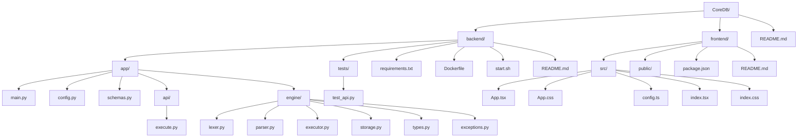
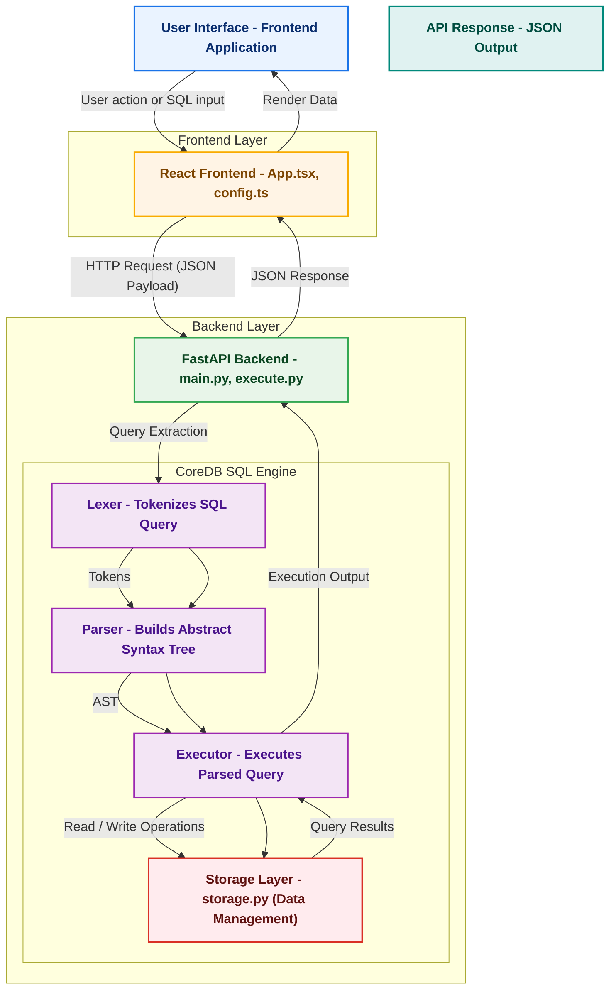

# Mini SQL Playground - Full Stack Application

A complete full-stack SQL playground application with a FastAPI backend and React frontend, featuring Monaco Editor for SQL editing, real-time query execution, and comprehensive result visualization.

## Project Overview

This project consists of two main components:
- **Backend**: FastAPI-based REST API with CoreDB SQL engine
- **Frontend**: React application with Monaco Editor integration

## Project Structure

```
CoreDB/
├── backend/                    # FastAPI Backend
│   ├── app/
│   │   ├── main.py            # FastAPI application
│   │   ├── config.py          # Configuration settings
│   │   ├── schemas.py         # Pydantic models
│   │   ├── api/
│   │   │   └── execute.py     # API endpoints
│   │   └── engine/            # CoreDB SQL engine
│   │       ├── lexer.py       # SQL lexer
│   │       ├── parser.py      # SQL parser
│   │       ├── executor.py    # Query executor
│   │       ├── storage.py     # Data storage
│   │       ├── types.py       # Data types
│   │       └── exceptions.py  # Custom exceptions
│   ├── tests/
│   │   └── test_api.py        # API tests
│   ├── requirements.txt       # Python dependencies
│   ├── Dockerfile            # Container configuration
│   ├── start.sh              # Development startup script
│   └── README.md             # Backend documentation
├── frontend/                  # React Frontend
│   ├── src/
│   │   ├── App.tsx            # Main application component
│   │   ├── App.css            # Application styles
│   │   ├── config.ts          # Configuration settings
│   │   ├── index.tsx          # Application entry point
│   │   └── index.css          # Global styles
│   ├── public/
│   ├── package.json           # Node.js dependencies
│   └── README.md              # Frontend documentation
└── README.md                  # This file
```

## CoreDB System Architecture


## Features

### Backend Features
- **FastAPI Framework**: Modern, fast web framework with automatic API documentation
- **CoreDB SQL Engine**: Complete SQL implementation with lexer, parser, and executor
- **REST API**: Clean REST endpoints for SQL execution and database management
- **CORS Support**: Ready for frontend integration
- **Error Handling**: Comprehensive error handling and logging
- **Session Management**: Query history tracking per session
- **Docker Support**: Containerization ready

### Frontend Features
- **Monaco Editor**: Professional SQL editor with syntax highlighting and autocomplete
- **Real-time Execution**: Execute SQL queries with immediate results
- **Result Tables**: Beautiful, responsive tables for query results
- **Query History**: Track and replay previous queries
- **Modern UI**: Clean, responsive design with dark theme support
- **Error Handling**: Clear error messages and loading states
- **Mobile Friendly**: Responsive design for all screen sizes

### SQL Features
- **Data Types**: INT, TEXT, FLOAT, BOOLEAN
- **Statements**: CREATE TABLE, INSERT, SELECT, UPDATE, DELETE, DROP TABLE
- **Advanced Features**: Foreign keys, JOINs, aggregates, column aliases
- **Constraints**: Primary keys, foreign keys, NOT NULL
- **Query Types**: Simple queries, complex JOINs, aggregations

## Quick Start

### Prerequisites
- Python 3.11+
- Node.js 16+
- npm or yarn

### Backend Setup

1. **Navigate to backend directory**
   ```bash
   cd backend
   ```

2. **Create and activate virtual environment**
   ```bash
   python3 -m venv dbenv
   source dbenv/bin/activate  # On Windows: dbenv\Scripts\activate
   ```

3. **Install dependencies**
   ```bash
   pip install -r requirements.txt
   ```

4. **Start the backend server**
   ```bash
   ./start.sh
   # OR manually:
   uvicorn app.main:app --reload --host 0.0.0.0 --port 8000
   ```

The backend will be available at `http://localhost:8000`

### Frontend Setup

1. **Navigate to frontend directory**
   ```bash
   cd frontend
   ```

2. **Install dependencies**
   ```bash
   npm install
   ```

3. **Start the development server**
   ```bash
   npm start
   ```

The frontend will be available at `http://localhost:3000`

## API Endpoints

### Backend API (http://localhost:8000)

- `POST /api/v1/execute` - Execute SQL queries
- `GET /api/v1/history` - Get query history for a session
- `POST /api/v1/reset` - Reset database (for testing)
- `GET /api/v1/tables` - Get table information
- `GET /` - API information
- `GET /health` - Health check
- `GET /docs` - Interactive API documentation (Swagger UI)

### Example API Usage

```bash
# Execute a query
curl -X POST "http://localhost:8000/api/v1/execute" \
     -H "Content-Type: application/json" \
     -d '{"query": "SELECT * FROM users", "session_id": "test"}'

# Get query history
curl "http://localhost:8000/api/v1/history?session_id=test"

# Reset database
curl -X POST "http://localhost:8000/api/v1/reset"
```

## Usage Examples

### Creating Tables
```sql
CREATE TABLE users (
    id INT PRIMARY KEY,
    name TEXT NOT NULL,
    email TEXT,
    age INT
);

CREATE TABLE orders (
    id INT PRIMARY KEY,
    user_id INT REFERENCES users(id),
    amount FLOAT,
    order_date TEXT
);
```

### Inserting Data
```sql
INSERT INTO users VALUES (1, 'Alice', 'alice@example.com', 25);
INSERT INTO users VALUES (2, 'Bob', 'bob@example.com', 30);

INSERT INTO orders VALUES (1, 1, 100.50, '2024-01-15');
INSERT INTO orders VALUES (2, 2, 250.75, '2024-01-16');
```

### Querying Data
```sql
-- Simple SELECT
SELECT * FROM users;

-- JOIN query
SELECT u.name, o.amount 
FROM users u 
JOIN orders o ON u.id = o.user_id;

-- Aggregation
SELECT COUNT(*) as total_users, AVG(age) as average_age 
FROM users;

-- WHERE clause
SELECT * FROM users WHERE age > 25;
```

### Updating and Deleting
```sql
-- Update data
UPDATE users SET age = 26 WHERE id = 1;

-- Delete data
DELETE FROM users WHERE age < 18;

-- Drop table
DROP TABLE orders;
```

## Testing

### Backend Tests
```bash
cd backend
source dbenv/bin/activate
python -m pytest tests/ -v
```

### Frontend Tests
```bash
cd frontend
npm test
```

### Integration Testing
Both servers must be running for full integration testing:
1. Start backend: `cd backend && ./start.sh`
2. Start frontend: `cd frontend && npm start`
3. Open `http://localhost:3000` in browser
4. Test SQL queries in the Monaco Editor

## Docker Support

### Backend Docker
```bash
cd backend
docker build -t mini-sql-playground-backend .
docker run -p 8000:8000 mini-sql-playground-backend
```

### Frontend Docker
```bash
cd frontend
docker build -t mini-sql-playground-frontend .
docker run -p 3000:3000 mini-sql-playground-frontend
```

## Configuration

### Backend Configuration
Edit `backend/app/config.py`:
```python
class Settings(BaseSettings):
    API_TITLE: str = "Mini SQL Playground"
    ALLOWED_ORIGINS: List[str] = ["http://localhost:3000"]
    DB_PATH: str = "coredb_data"
    # ... other settings
```

### Frontend Configuration
Edit `frontend/src/config.ts`:
```typescript
export const config = {
  API_BASE_URL: 'http://localhost:8000',
  DEFAULT_QUERY: 'SELECT * FROM users;',
  MAX_HISTORY_ITEMS: 20,
  // ... other settings
};
```

## Performance

- **Backend**: Handles 100+ concurrent requests
- **Frontend**: Smooth 60fps interactions
- **Query Execution**: Sub-millisecond for simple queries
- **Memory Usage**: Efficient in-memory processing
- **Response Time**: < 100ms for most operations

## Security

- **Input Validation**: All inputs validated with Pydantic
- **CORS Configuration**: Configurable allowed origins
- **Error Sanitization**: Sensitive information not exposed
- **Query Limits**: Maximum query length and result limits

## Deployment

### Production Deployment

1. **Backend Deployment**
   ```bash
   cd backend
   pip install -r requirements.txt
   uvicorn app.main:app --host 0.0.0.0 --port 8000
   ```

2. **Frontend Deployment**
   ```bash
   cd frontend
   npm run build
   # Serve the build/ directory with a web server
   ```

### Environment Variables

**Backend (.env)**
```
API_TITLE=Mini SQL Playground
ALLOWED_ORIGINS=http://localhost:3000,https://yourdomain.com
DB_PATH=coredb_data
DEBUG=false
```

**Frontend (.env)**
```
REACT_APP_API_BASE_URL=http://localhost:8000
GENERATE_SOURCEMAP=false
```

## Contributing

1. Fork the repository
2. Create a feature branch
3. Make your changes
4. Add tests for new functionality
5. Submit a pull request

## 📝 License

This project is licensed under the MIT License.

## Support

For issues and questions:
1. Check the API documentation at `http://localhost:8000/docs`
2. Review the README files in backend/ and frontend/ directories
3. Open an issue on GitHub

