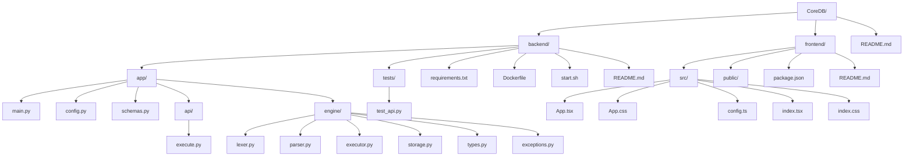
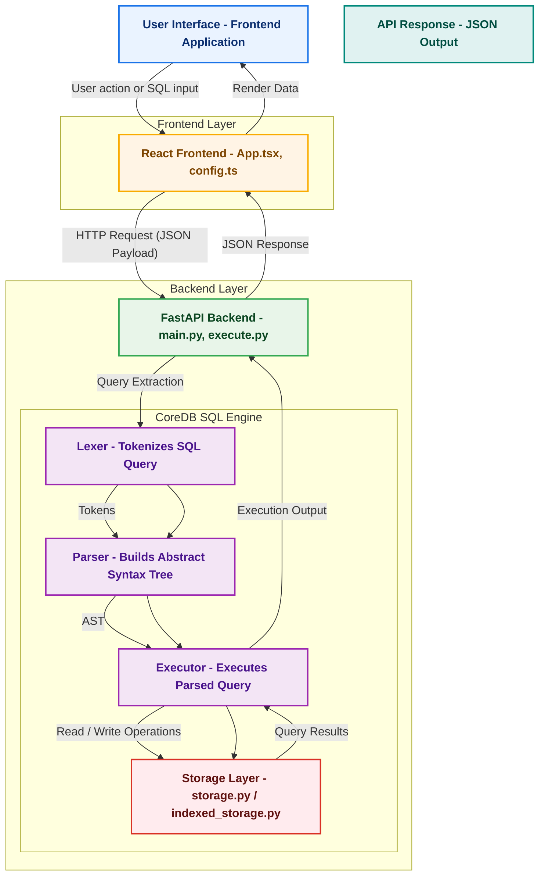
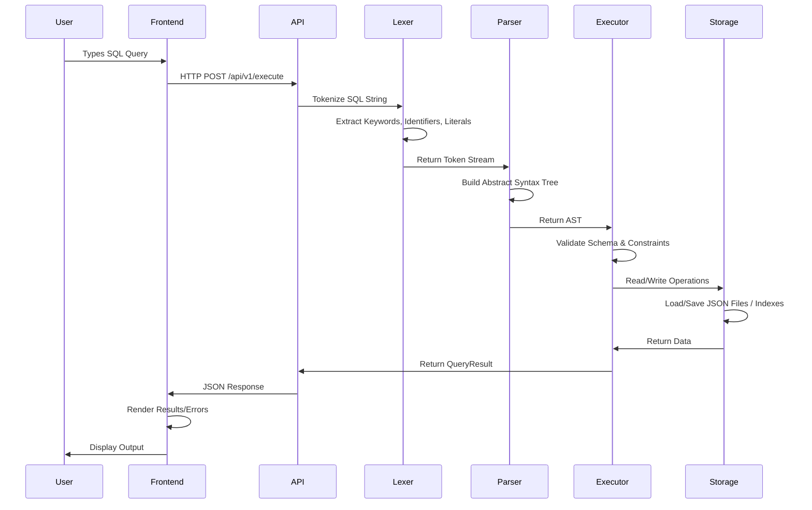

# CoreDB System Diagrams

## Project Directory Structure

```mermaid
graph TD
    A[CoreDB/] --> B[backend/]
    A --> C[frontend/]
    A --> D[README.md]
    %% Backend
    B --> B1[app/]
    B --> B2[tests/]
    B --> B3[requirements.txt]
    B --> B4[Dockerfile]
    B --> B5[start.sh]
    B --> B6[README.md]
    B1 --> B11[main.py]
    B1 --> B12[config.py]
    B1 --> B13[schemas.py]
    B1 --> B14[api/]
    B1 --> B15[engine/]
    B14 --> B141[execute.py]
    B15 --> B151[lexer.py]
    B15 --> B152[parser.py]
    B15 --> B153[executor.py]
    B15 --> B154[storage.py]
    B15 --> B155[types.py]
    B15 --> B156[exceptions.py]
    B2 --> B21[test_api.py]
    %% Frontend
    C --> C1[src/]
    C --> C2[public/]
    C --> C3[package.json]
    C --> C4[README.md]
    C1 --> C11[App.tsx]
    C1 --> C12[App.css]
    C1 --> C13[config.ts]
    C1 --> C14[index.tsx]
    C1 --> C15[index.css]
```

## System Architecture and Query Flow

```mermaid
flowchart TD
    classDef user fill:#eaf3ff,stroke:#1a73e8,stroke-width:2px,color:#0b2e6f,font-weight:bold;
    classDef frontend fill:#fff4e5,stroke:#f9ab00,stroke-width:2px,color:#7c4400,font-weight:bold;
    classDef backend fill:#e8f5e9,stroke:#34a853,stroke-width:2px,color:#0b4621,font-weight:bold;
    classDef engine fill:#f3e5f5,stroke:#9c27b0,stroke-width:2px,color:#4a148c,font-weight:bold;
    classDef storage fill:#ffebee,stroke:#d93025,stroke-width:2px,color:#5f1210,font-weight:bold;
    classDef api fill:#e0f2f1,stroke:#00897b,stroke-width:2px,color:#004d40,font-weight:bold;
    U["User Interface - Frontend Application"]:::user
    F["React Frontend - App.tsx, config.ts"]:::frontend
    A["FastAPI Backend - main.py, execute.py"]:::backend
    L["Lexer - Tokenizes SQL Query"]:::engine
    P["Parser - Builds Abstract Syntax Tree"]:::engine
    E["Executor - Executes Parsed Query"]:::engine
    S["Storage Layer - storage.py / indexed_storage.py"]:::storage
    R["API Response - JSON Output"]:::api
    U -->|"User action or SQL input"| F
    F -->|"HTTP Request (JSON Payload)"| A
    A -->|"Query Extraction"| L
    L -->|"Tokens"| P
    P -->|"AST"| E
    E -->|"Read / Write Operations"| S
    S -->|"Query Results"| E
    E -->|"Execution Output"| A
    A -->|"JSON Response"| F
    F -->|"Render Data"| U
    subgraph FRONTEND ["Frontend Layer"]
        direction TB
        F
    end
    subgraph BACKEND ["Backend Layer"]
        direction TB
        A
        subgraph ENGINE ["CoreDB SQL Engine"]
            direction TB
            L --> P --> E --> S
        end
    end
```

## Query Processing Pipeline

```mermaid
sequenceDiagram
    participant User
    participant Frontend
    participant API
    participant Lexer
    participant Parser
    participant Executor
    participant Storage
    User->>Frontend: Types SQL Query
    Frontend->>API: HTTP POST /api/v1/execute
    API->>Lexer: Tokenize SQL String
    Lexer->>Lexer: Extract Keywords, Identifiers, Literals
    Lexer->>Parser: Return Token Stream
    Parser->>Parser: Build Abstract Syntax Tree
    Parser->>Executor: Return AST
    Executor->>Executor: Validate Schema & Constraints
    Executor->>Storage: Read/Write Operations
    Storage->>Storage: Load/Save JSON Files / Indexes
    Storage->>Executor: Return Data
    Executor->>API: Return QueryResult
    API->>Frontend: JSON Response
    Frontend->>Frontend: Render Results/Errors
    Frontend->>User: Display Output
```

